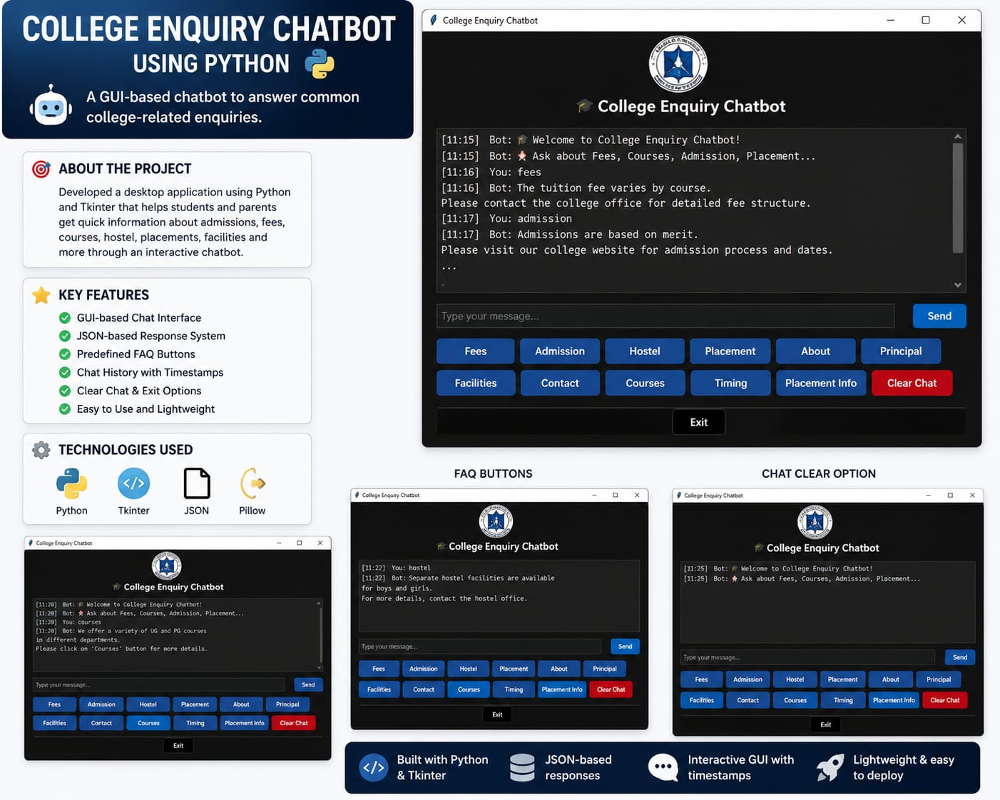

# College Enquiry Chatbot Using Python

## Project Screenshot

## Overview

This is a GUI-based college enquiry chatbot developed using Python and Tkinter.

The chatbot helps students access information related to:
- Fees
- Admission
- Hostel
- Placement
- Courses
- Facilities
- Contact Details

## Features

- GUI-based Chat Interface
- JSON-based Response System
- FAQ Buttons
- Chat History with Timestamps
- Clear Chat Functionality
- Easy-to-use Interface

## Technologies Used

- Python
- Tkinter
- JSON
- Pillow

## Project Structure

COLLEGE CHATBOT
├── chatbot.py
├── responses.json
└── logo.jpeg

## Future Improvements

- Database Integration
- AI-based Responses
- Voice Support

  ## Project Screenshot

